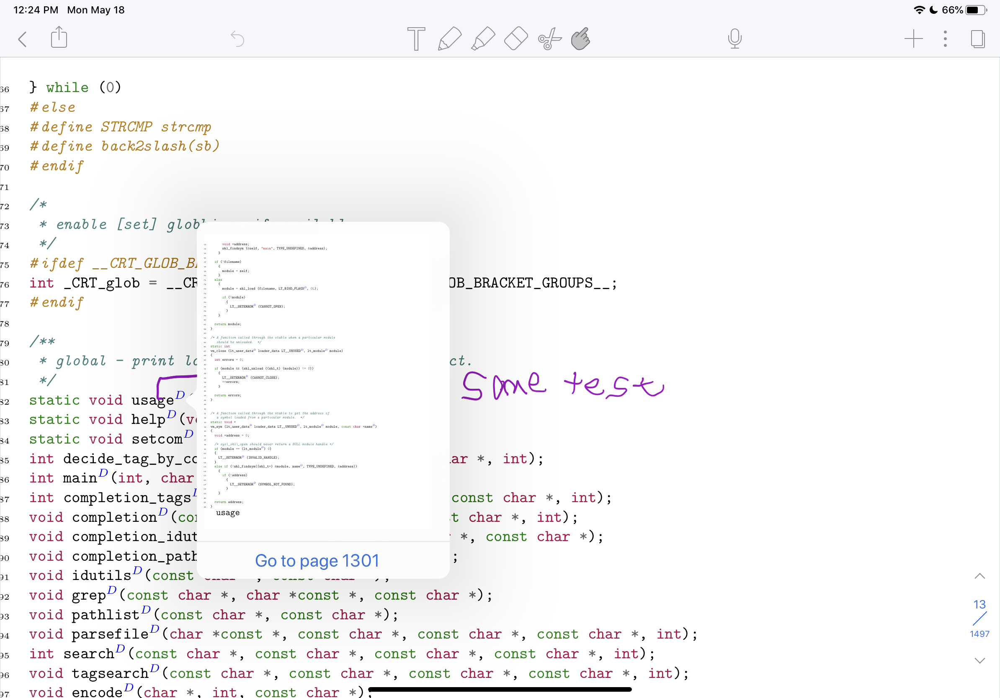

# PDFCode

PDFCode is a source code to PDF generation program.
It creates a listing of your source code with hyperlinks
to the various definitions. It uses GNU Global (potentially
with Pygments or some version of Ctags) to link code together.
For example, uses of a struct or function are linked to their
definition.

PDFCode was inspired by the htags program of GNU Global.

The main reason for designing PDFCode was to test the
ability to use programs such as Noteability or GoodNotes
etc. to annotate source code. Linking of the code was
done to facilitate a more editor like environment.

As of current, this is a spike version. It is more or less
functional; however, it still has its issues. Some special
characters used in LATEX are escape in a weird and noticeably
non-original source code manner (ex. _ is \_)

We use pipenv to list Python3 required libraries.

Pygments and LATEX must be installed to generate the PDF.
Furthermore, you must have a version of GNU Global installed
with sqlite3 support.

## Usage

```
cd ${YOUR_SOURCE_CODE_PATH}
gtags --sqlite3
python3 ${PATH_TO_PDFCODE}/PDFCode.py
mv test.pdf ${YOUR_NAME}.pdf
```

# Example in Noteability



## Notes

1. It is advisable if doing this on a large codebase
   to do it on individual modules/folders.
2. Currently, the code is very c-centric. If your code
   is a lisp-like or something else, there may be some
   issues.
3. Currently, the code is a prototype/spike version. Thus,
   there is probably still some bugs to work out.
4. Reverse tags from defintion to uses are not enabled by
   default as they greatly increase the size of the PDF file.
5. Notes programs such as Goodnotes or Noteability may struggle
   in opening large files.
   - I.E. your usage may vary.

## Other Notes

PDFCode is in no way affliated with Noteability or GoodNotes.
These are only programs we have used previously. Other programs
with similar functionality do exist. A Google search of tablet
natural writing programs should yield other results.

GoodNotes is an app from © Time Base Technology Limited 2018.

Notability is a registered trademark of Ginger Labs, Inc. © 2020 Ginger Labs, Inc. All rights reserved.